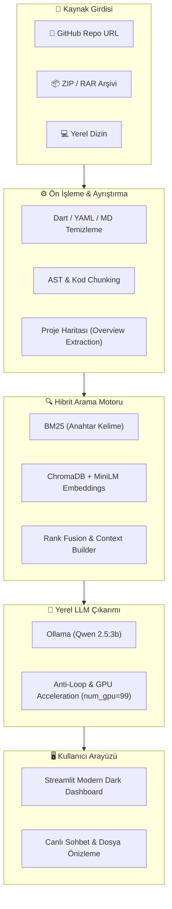

# ⚡ Flutter & Dart Codebase Architecture Assistant (Local RAG)

[](https://python.org)
[](https://streamlit.io)
[](https://ollama.com)
[](https://www.trychroma.com)
[](#)
[](LICENSE)

> **%100 Yerel, Gizlilik Odaklı ve Hibrit RAG (BM25 + Vektör Arama) Destekli Flutter Kod Tabanı ve Mimari Asistanı.**  
> Kodlarınızı buluta göndermeden, herhangi bir Flutter projesini (`.zip`, `.rar` veya doğrudan **GitHub URL'si**) saniyeler içinde analiz edin, mimarisini sorgulayın ve Dart kodları hakkında Türkçe / İngilizce soru sorun.

---

## 🚀 Öne Çıkan Özellikler

- 🔒 **%100 Yerel & Gizlilik Odaklı:** Tüm RAG hattı ve LLM (`Qwen2.5:3b`) yerel makinenizde (Ollama) çalışır. Hiçbir API anahtarı veya bulut bağımlılığı gerekmez.
- ⚡ **Tüketici GPU'larında Süper Hızlı:** AMD (DirectML/ROCm/Vulkan) ve NVIDIA GPU'larda ~5-10 saniye yanıt süresi.
- 🔍 **Hibrit Arama (Hybrid Search):**
  - **BM25 (Keyword Retrieval):** Özel değişken, fonksiyon ve sınıf isimlerini hatasız yakalar.
  - **ChromaDB + Sentence Transformers:** `paraphrase-multilingual-MiniLM-L12-v2` ile çok dilli anlamsal (semantik) eşleşme.
- 🌐 **Dinamik Proje Yükleme:**
  - 🔗 **GitHub URL'si:** Herhangi bir açık kaynaklı Flutter reposunun linkini yapıştırarak anında analiz edin (`main` / `master` otomatik algılanır).
  - 📦 **Arşiv Dosyaları:** `.zip` ve `.rar` projelerini tek tıkla yükleyin.
- 📱 **Flutter & Dart AST-Aware:** `lib/`, `pubspec.yaml`, `assets/`, `features/`, `controllers/` ve ekran mimarisini anlayarak template boilerplate yerine gerçek iş mantığını açıklar.
- 📚 **Kaynak Atıfları (Citations):** Model yanıt verirken hangi dosyalardan ve kod bloklarından yararlandığını şeffaf bir şekilde listeler.

---

## 🏗️ Mimari Şeması (Architecture)



---

## 🛠️ Kurulum ve Çalıştırma

### 1. Gereksinimler
- Python 3.10+
- [Ollama](https://ollama.com) kurulu ve çalışıyor olmalıdır.

### 2. Modeli İndirin (Ollama)
```bash
ollama run qwen2.5:3b
```

### 3. Projeyi Klonlayın ve Bağımlılıkları Yükleyin
```bash
git clone https://github.com/dyuta6/flutter-rag-asistant-.git
cd flutter-rag-asistant-

# Sanal ortam oluşturma (Önerilen)
python -m venv .venv
source .venv/bin/activate  # Windows için: .venv\Scripts\activate

# Bağımlılıkları yükleyin
pip install -r requirements.txt
```

### 4. Uygulamayı Başlatın
```bash
streamlit run app.py
```
Tarayıcınızda otomatik olarak `http://localhost:8501` açılacaktır.

---

## 💡 Örnek Kullanım Senaryoları

1. **GitHub Projesi Analizi:**
   - Sol menüden **"GitHub Reposu (URL)"** seçin.
   - Örn: `https://github.com/dyuta6/arc_ribbon_menu` veya `https://github.com/dyuta6/deeptalks`
   - *"Proje ne hakkında ve ana mimarisi nasıl kurulmuş?"*
2. **Durum Yönetimi (State Management) İncelemesi:**
   - *"Bu projede Riverpod / Bloc / Provider nasıl kullanılmış, state nereden yönetiliyor?"*
3. **Widget ve UI Analizi:**
   - *"HomeScreen içerisinde hangi widget'lar ve animasyon kontrolcüleri var?"*
4. **Bağımlılık ve Paket Kontrolü:**
   - *"pubspec.yaml içinde hangi harici servisler tanımlanmış?"*

---

## 📊 Teknolojiler

| Bileşen | Kullanılan Teknoloji / Model |
| :--- | :--- |
| **Arayüz** | [Streamlit](https://streamlit.io) |
| **Vektör Veritabanı** | [ChromaDB](https://www.trychroma.com/) |
| **Embedding Modeli** | `paraphrase-multilingual-MiniLM-L12-v2` |
| **Keyword Search** | `rank-bm25` (Okapi BM25) |
| **Lokal LLM** | `Qwen2.5:3b` via [Ollama](https://ollama.com) |
| **Dil Desteği** | Türkçe & İngilizce (Tam Uyum) |

---

## 🤝 Katkıda Bulunma (Contributing)
1. Bu depoyu fork'layın (`Fork`)
2. Yeni özellik dalınızı oluşturun (`git checkout -b feature/YeniOzellik`)
3. Değişikliklerinizi commit edin (`git commit -m 'feat: Yeni özellik eklendi'`)
4. Dalınıza push yapın (`git push origin feature/YeniOzellik`)
5. Bir **Pull Request** açın.

---

## 📄 Lisans
Bu proje [MIT](LICENSE) lisansı altında sunulmaktadır.
